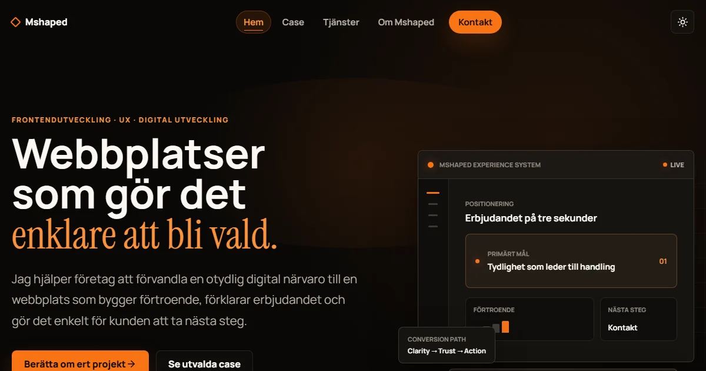

# Mshaped Portfolio

En modern portfolio och konsultwebbplats där strategi, UX och frontendutveckling
möts. Webbplatsen presenterar Mshapeds erbjudande, arbetsprocess och ett växande
urval av interaktiva case.

[Besök webbplatsen](https://markus-portfolio-demo.netlify.app/) ·
[Se projekten](https://markus-portfolio-demo.netlify.app/projects) ·
[Kontakta mig](https://markus-portfolio-demo.netlify.app/contact)



## Om projektet

Mshaped är byggd för två målgrupper: företag som söker hjälp med sin digitala
närvaro och rekryterare som vill se hur jag arbetar med design, kod och
problemlösning.

Webbplatsen kombinerar en mörk visuell identitet med redaktionell typografi,
responsiv layout och projektsidor som går djupare än traditionella portfoliokort.
Flera case innehåller även fungerande prototyper direkt i webbplatsen.

## Utvalda case

| Projekt | Fokus | Status |
| --- | --- | --- |
| Solar Expanse | Scrollstyrd solsystemsvisualisering | Interaktiv prototyp |
| Playdate Planner | Mobil UX för planering mellan familjer | Produktprototyp |
| The Five Crystals | Webbaserat 3D-äventyr | Spelbar prototyp |
| Nordvik Fastigheter | Informationsarkitektur och konvertering | UX/UI-case |
| Eld & Ek | Varumärkesupplevelse för restaurang | UX/UI-case |
| Automation Toolkit | PowerShell och Windows-automation | Pågående projekt |

## Funktioner

- Responsiv portfolio med separata sidor för tjänster, projekt och kontakt
- Återanvändbara projektkort med centralt hanterad projektdata
- Detaljerade case-sidor med tydlig problem-, process- och lösningsstruktur
- Interaktiva prototyper byggda med React, Three.js och Vanilla JavaScript
- Tillgänglig navigation, fokusmarkeringar och stöd för reducerad rörelse
- SEO-metadata, sitemap, robots.txt och social delningsbild
- Kontaktformulär förberett för Netlify Forms
- Supabase-integration i Playdate Planner

## Teknik

- React 19
- TypeScript
- Vite
- React Router
- Framer Motion
- Three.js
- Supabase
- Modern CSS med design tokens
- Lucide Icons

## Projektstruktur

```text
src/
├── components/     Återanvändbara UI-komponenter
├── data/           Projektdata, metadata och innehåll
├── hooks/          Egna React-hooks
├── pages/          Webbplatsens huvudsidor
├── projects/       Fristående case och prototyper
├── sections/       Startsidessektioner
└── services/       Integrationer och formulärlogik

assets/source/      Redigerbara originalbilder
docs/cases/         Case-dokumentation
public/assets/      Optimerade produktionsbilder
scripts/            Asset- och dokumentverktyg
```

## Kom igång

### Förutsättningar

- Node.js 20 eller senare
- npm

### Installation

```bash
git clone git@github.com:markusbylund/mshaped-portfolio.git
cd mshaped-portfolio
npm install
```

Kopiera `.env.example` till `.env` och fyll i dina publika Supabase-variabler om
du vill testa Playdate Planners autentisering:

```env
VITE_SUPABASE_URL=https://your-project.supabase.co
VITE_SUPABASE_ANON_KEY=your-public-anon-key
```

Starta utvecklingsservern:

```bash
npm run dev
```

Öppna sedan adressen som Vite visar i terminalen.

## Tillgängliga kommandon

| Kommando | Beskrivning |
| --- | --- |
| `npm run dev` | Startar lokal utvecklingsserver |
| `npm run check` | Kör TypeScript-kontroll |
| `npm run build` | Skapar ett produktionsbygge |
| `npm run preview` | Förhandsvisar produktionsbygget |
| `npm run assets:optimize` | Optimerar case-bilder för webben |

## Deployment

Projektet kan deployas direkt till Netlify eller Vercel.

Rekommenderade bygginställningar:

```text
Build command: npm run build
Publish directory: dist
```

`public/_redirects` hanterar klientbaserad routing vid direktbesök på
undersidor i Netlify.

## Innehåll och anpassning

- Projekt och projektstatus: `src/data/projects.ts`
- Kontaktuppgifter och sociala länkar: `src/data/site.ts`
- SEO-metadata: `src/data/seo.ts`
- Råa projektbilder: `assets/source/`
- Optimerade bilder: `public/assets/`
- Case-dokumentation: `docs/cases/`
- Tonalitet och copyprinciper: `docs/content-tone.md`
- Fortsatt förbättringsarbete: `TODO.md`

## Kontakt

**Markus Bylund**

- [LinkedIn](https://www.linkedin.com/in/markusbylund/)
- [GitHub](https://github.com/markusbylund)
- [E-post](mailto:markusbylund@hotmail.com)

---

Byggd och vidareutvecklad av Markus Bylund.
